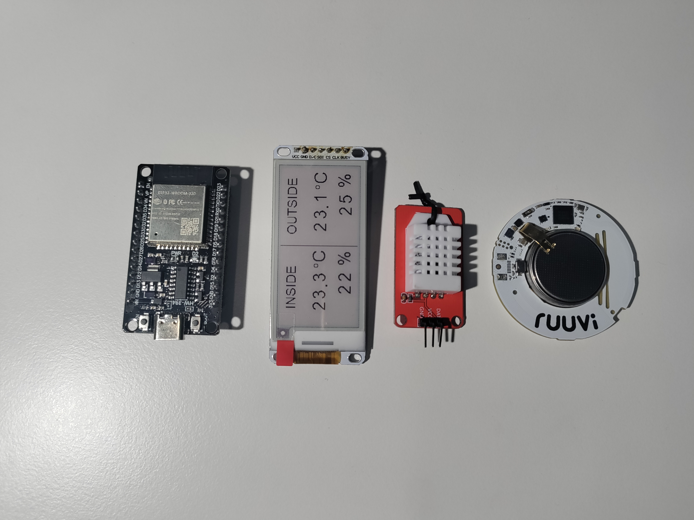
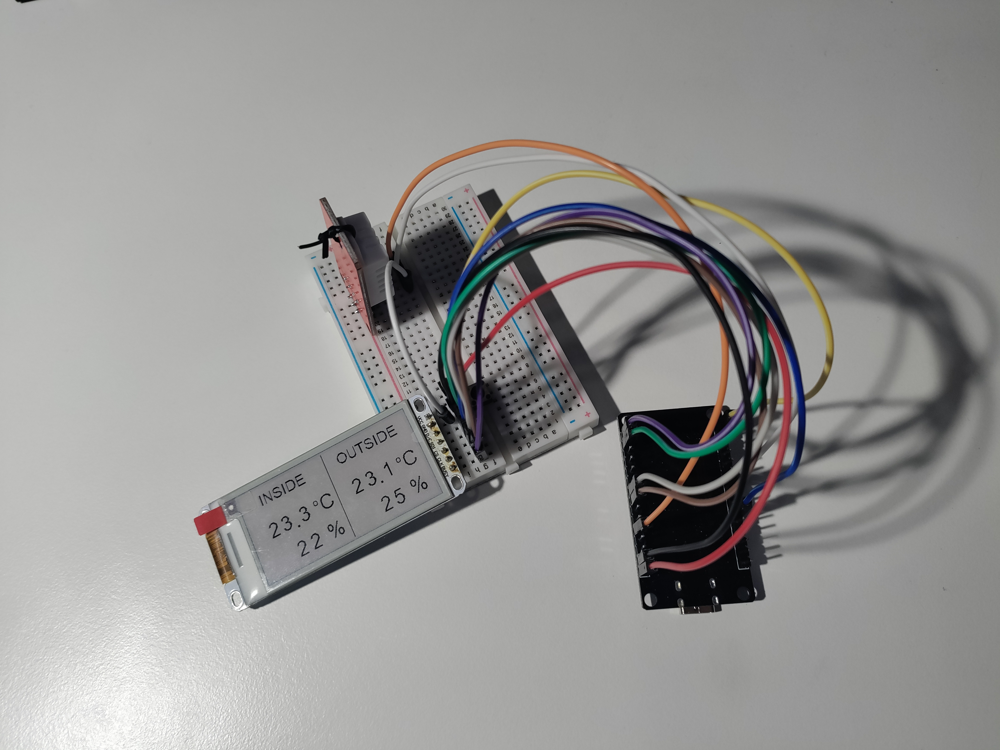

# Low-power temperature monitor

This project uses an ESP32 and an e-ink screen to display temperature and humidity values from two temperature meters. Its power consumption is also somewhat optimized.

### Parts

1. ESP32 Development board
2. Heltec 2.13-inch e-ink module
3. RuuviTag wireless temperature meter
4. DHT22 temperature meter module

### Wiring

Screen pins -> ESP32

VCC -> 3.3V

GND -> GND

D/C -> D22

SDI -> D27

CS -> D18

CLK -> D5

BUSY -> D23       

DHT22 (module) -> ESP32

VCC -> D33

GND -> GND

DAT -> D4

### The code

The program reads RuuviTag's manufacturer information over BLE and then decodes it. The data contains the temperature and humidity information, which are then drawn to an e-ink display. Data is also read from DHT22 but luckily it's much easier. I couldn't get the newer libraries for the screen working so I had to use an old library that takes the picture information as a 4000-character long array. numbers.h includes the main array that is being updated as well as an array for each number. Modifying the picture is done by replacing parts of the original array with smaller arrays. 

### Power consumption

For minimal power consumption the ESP32 runs on 80 Mhz and goes to deep sleep when it's not needed. Ideally in deep sleep it should draw less than 1 mA but when comparing a few different boards I noticed that lower-quality boards can draw up to 10 mA. By removing the power led from one of my better ESP32 boards I was able to get the deep sleep current draw down to 1.7 mA. I also tried using a buck converter to power the board directly, but it ended up being less efficient than the onboard regulator. During deep sleep the e-ink screen doesn't seem to draw any current and the DHT22 module is turned off by cutting its power. To further lower the power consumption, the only options left are to get a better development board or bare WROOM32 / ESPRESSIF chip and a higher-quality buck converter.

Current draw in deep sleep: 1.7 mA

Average current draw while on: ~48 mA

If the screen updates every 20 minutes the average current draw is ~2.5 mA and the average power consumption is 12.5 mW

With a 10000 mAh powerbank the device could theoretically run for up to 4000 hours or 167 days.

### More

This project is still a work in progress.